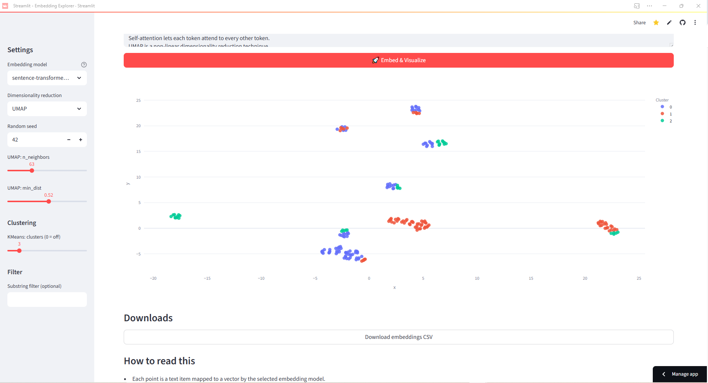

# Embedding Explorer — See Your Text in 2D

This is a simple, interactive Streamlit app I built to make text embeddings less mysterious and a lot more fun to explore.
You can:
- Upload a CSV with a text column (or just paste your text directly)
- Pick an embedding model from sentence-transformers
- Reduce the vectors to 2D with UMAP or t-SNE
- Color-code them with KMeans clusters (optional)
- Zoom, hover, filter, and download the results
- No API keys, no setup headaches — everything runs locally.

# Try It Out
Live app: [https://zasaee-text-embedding-visualizer-app-qmmew9.streamlit.app/] 
Want a quick example? Use the included sample_texts_multitheme.csv. It’s got four themes (ML, Healthcare, Finance, Manufacturing) so you’ll see nice, clean clusters right away.

# Why I Built This?!
- Embeddings are everywhere in modern ML and LLM workflows, but they’re hard to “see.” I wanted a quick way to:
- Explain embeddings visually when talking to non-technical folks
- Explore my own datasets before training a model
- Share an easy, no-login demo link with anyone
- This project also shows the kind of ML tooling I like to build: lightweight, clear, and ready to use.

# Example Run
Step 1 – Upload and set parameters

Step 2 – Visualize clusters in 2D

# Example Output
The Download embeddings CSV button gives you a file like this:

| text                                   | cluster | x     | y     | emb\_0 | emb\_1 | ... |
| -------------------------------------- | ------- | ----- | ----- | ------ | ------ | --- |
| "Transformers are powerful models..."  | 0       | -5.12 | 2.33  | 0.018  | -0.045 | ... |
| "AI assists early cancer detection..." | 1       | 3.41  | -1.87 | -0.012 | 0.032  | ... |

# How to Run Locally
git clone https://github.com/<your-username>/embedding-explorer.git
cd embedding-explorer
pip install -r requirements.txt
streamlit run app.py

# Deploy It Yourself (Free)
- Streamlit Community Cloud: Connect your GitHub repo → pick app.py → deploy.
- Hugging Face Spaces: Create a new Space → choose Streamlit → point it to your repo.

# What’s Happening Under the Hood
- Embeddings: sentence-transformers models map your text to high-dimensional vectors.
- Dimensionality Reduction: UMAP/t-SNE compress those vectors into 2D so you can see patterns.
- Clustering: KMeans assigns points to groups (optional).
- Filtering: Quickly find and highlight points containing a specific word/phrase.

